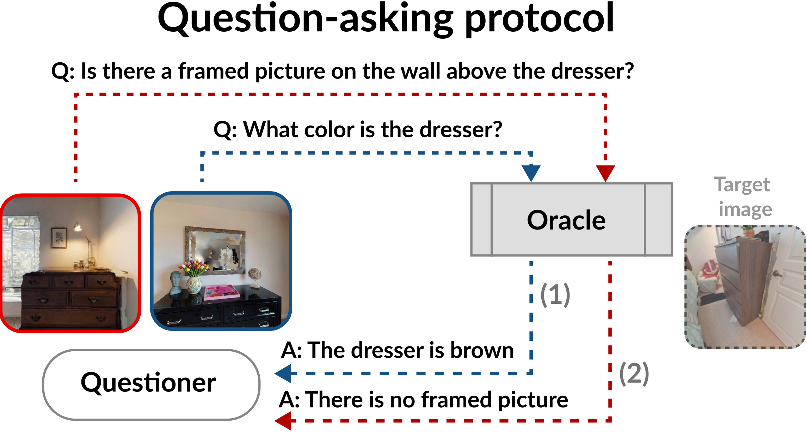

<!DOCTYPE html>
<html lang="en">
<head>
<meta charset="UTF-8">
<meta name="viewport" content="width=device-width, initial-scale=1.0">

<title>CoIN Challenge 2026</title>

</head>

<body>

<header>
    

        
CoIN Challenge 2026

        <nav class="nav-links">
            <a href="#overview">Overview</a>
            <a href="#dates">Dates</a>
            <a href="#leaderboard">Leaderboard</a>
            <a href="#submission">Submission</a>
            <a href="#organizers">Organizers</a>
        </nav>
    

</header>

<section class="hero">
    

        <h1>CoIN Challenge 2026</h1>
        

            Collaborative Instance-object Navigation (CoIN) challenge at Embodied Agent and Dialog Workshop @ ECCV 2026.
        

        

            <a href="#" class="btn btn-primary">Submit</a>
            <a href="https://arxiv.org/abs/2604.00265" class="btn btn-secondary">Paper</a>
            <a href="#" class="btn btn-secondary">Code</a>
        

    

</section>

    

<section id="overview" class="section">
    

        <h1>Overview</h1>
        

            Collaborative Instance-object Navigation (CoIN) requires an agent to navigate to a target object instance specified by natural language, <strong>collaborating, along the way, with a human user</strong>, in cluttered environments with many similar objects (distractors).
            On of the most important capabilities of such agents is the ability to ask the user for clarifying questions when facing uncertain detections or ambiguous instructions. Therefore, this challenge will <strong>test the agents' ability to ask questions to disambiguate similar objects during navigation.</strong> 
        

        <h2>Challenge</h2>
        In this challenge, participants will be asked to <strong>train multimodal agents</strong> that, given a object description in natural language and a image of an object, can either

1) determine whether the object shown in the image matches the given object description, or not (when sufficient information is available) 

2) ask a clarifying question to the user when the description and the image are ambiguous

<strong>The goal of the agents is to correctly identify the image that matches the object description, while asking as few questions as possible to the user.</strong> 
<h2> Evaluation </h2>
Each multimodal agent will be evaluated on N episodes, on a varied set of object descriptions and images. Each episode contains a variable number of images presented to the agent sequentially. 
The agents will be evaluated on a combination of accuracy and number of questions asked, with a strong emphasis on accuracy.
    

</section>

<section id="dates" class="section">
    

        <h2>Dates</h2>
        <strong>Challenge start date:</strong> June 15th 2026
        
<strong>Challenge end date:</strong> August 15th 2026

        
    

</section>

<section id="leaderboard" class="section">
    

        <h2>Leaderboard</h2>

        

            

                <h3>🥇 1st Place</h3>
                
TBD

            

            

                <h3>🥈 2nd Place</h3>
                
TBD

            

            

                <h3>🥉 3rd Place</h3>
                
TBD

            

        

    

</section>

<section id="submission" class="section">
    

        <h2>Submission</h2>
            The participants will have access to <strong>the codebase and a training set of episodes</strong> to use to train and tune their agents. 
            The participants will be asked to submit their trained agents (weights uploaded to huggingface) before the deadline, alongside a technical report and the original code. 
            These agents will be evaluated on a held-out test set of episodes that will be released after the deadline. 
        
    

</section>

<section id="organizers" class="section">
    

        <h2>Organizers</h2>

        

            <article class="mini-person"><h3><a href="" target="_blank" rel="noopener">Edoardo Zorzi</a></h3>
Sapienza University of Rome, Italy
Ph.D Student.</article>
            <article class="mini-person"><h3><a href="" target="_blank" rel="noopener">Yiming Wang</a></h3>
Fondazione Bruno Kessler, Trento, Italy
Senior Researcher.</article>
        

    

</section>

<section id="citation" class="section">
    

      <h2>Citation</h2>
      

        If you use the provided materials, please cite the relevant paper below.
      

      

        

          <h3 id="citation-rain">CoIN</h3>
          <pre><code>@InProceedings{taioli2025coin,
          author    = {Taioli, Francesco and Zorzi, Edoardo and Franchi, Gianni and Castellini, Alberto and Farinelli, 
            Alessandro and Cristani, Marco and Wang, Yiming},
          title     = {Collaborative Instance Object Navigation: Leveraging Uncertainty-Awareness to Minimize Human-Agent Dialogues},
          booktitle = {Proceedings of the IEEE/CVF International Conference on Computer Vision (ICCV)},
          month     = {October},
          year      = {2025},
          pages     = {18781-18792}
      }</code></pre>
        

        

          <h3 id="citation-rain">Question asking for CoIN</h3>
          <pre><code>@InProceedings{zorzi2026coinqa,
          author    = {Zorzi, Edoardo and Taioli, Francesco and Wang, Yiming and Cristani, Marco and Farinelli, 
            Alessandro and Castellini, Alberto and Bazzani, Loris},
          title     = {Benchmarking Interaction, Beyond Policy: a Reproducible Benchmark for Collaborative Instance Object Navigation},
          booktitle = {https://arxiv.org/pdf/2604.00265},
          month     = {March},
          year      = {2026},
      }</code></pre>
        

      

      

    </section>

<footer>
    

        CoIN Challenge 2026 - ECCV 2026 Workshop on Embodied Agents and Dialog. All rights reserved.
    

</footer>

</body>
</html>
